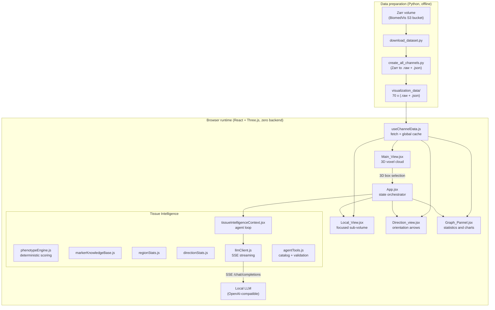
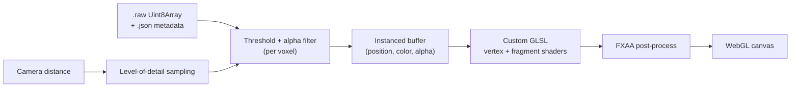
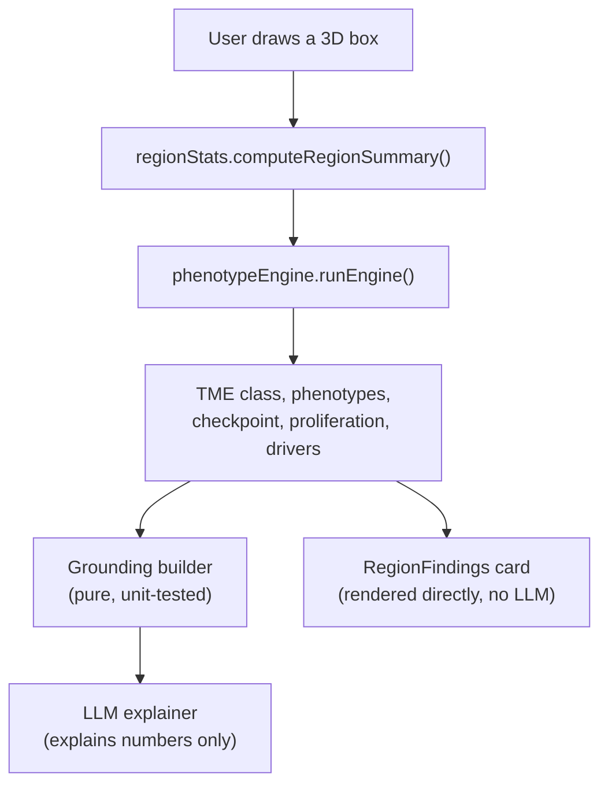
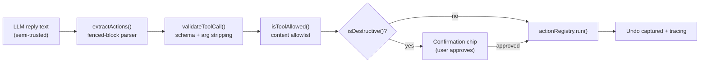

# Melanoma Tissue Volumes (MTV)

An interactive, browser-based 3D visualization and analysis dashboard for
multiplexed Cyclic Immunofluorescence (CyCIF) microscopy of melanoma tissue. It
renders a 70-channel volumetric biopsy as a real-time WebGL point cloud and
layers a grounded, agentic AI assistant ("Tissue Intelligence") on top of a
deterministic computational-pathology engine.

The entire application runs client-side. There is no backend service, no
database, and no server-side rendering: voxel data is served as static files and
the language model is a user-configured, local, OpenAI-compatible endpoint that
the browser talks to directly.

- **Course context:** Visual Data Science, University of Illinois Chicago (UIC).
- **Collaborators:** Dr. Lei Duan and Dr. Carl Maki (Rush University).
- **Dataset:** BiomedVis Challenge 2025, specimen LSP13626 (melanoma in situ),
  Laboratory of Systems Pharmacology, Harvard Medical School.
- **Stack:** React 18, Three.js, Vite, D3.js, vanilla CSS, and any local
  OpenAI-compatible LLM runtime (Ollama, LM Studio, llama.cpp, vLLM, LocalAI).

---

## Table of contents

1. [What this project does](#1-what-this-project-does)
2. [Feature overview](#2-feature-overview)
3. [System architecture](#3-system-architecture)
4. [The dataset and how to prepare it](#4-the-dataset-and-how-to-prepare-it)
5. [Running the project](#5-running-the-project)
6. [Tissue Intelligence: the AI layer](#6-tissue-intelligence-the-ai-layer)
7. [Evaluation and testing](#7-evaluation-and-testing)
8. [Project structure](#8-project-structure)
9. [Engineering highlights](#9-engineering-highlights)
10. [Limitations and disclaimer](#10-limitations-and-disclaimer)

---

## 1. What this project does

CyCIF imaging stains a single tissue section repeatedly with different antibody
panels, producing a stack of co-registered channels where each channel measures
the abundance of one biomarker (for example SOX10, MART1, CD8a, PDL1). The source
specimen here is a melanoma in situ biopsy imaged across 70 channels and three
spatial dimensions.

MTV turns that raw volume into something a researcher can explore and reason
about:

- It reconstructs the tissue as an interactive 3D point cloud in the browser, one
  colored layer per biomarker, with per-channel thresholding and adaptive
  level-of-detail so millions of voxels stay responsive.
- It lets the user draw 3D sub-volumes ("boxes") and, for each, computes
  deterministic per-marker statistics, candidate cell-population phenotypes, a
  tumor-microenvironment classification, a checkpoint/exhaustion signal, and a
  proliferation index.
- It provides an AI assistant that explains those computed findings in biological
  context and can operate the application on the user's behalf (toggle channels,
  draw selections, change views, compare regions) through a validated, auditable
  tool interface.

The guiding principle is a strict separation between deterministic computation
and language-model interpretation: the engine produces the numbers, and the LLM
only ever explains numbers that already exist. This keeps the system from
reading as a thin wrapper around a chat API and structurally limits
hallucination.

---

## 2. Feature overview

### Visualization

- **Four coordinated panels.**

  | Panel | Purpose |
  | ----- | ------- |
  | Main View | Full-volume 3D voxel cloud, multi-channel overlay, interactive 3D box selection. |
  | Local View | High-resolution render of a single user-selected sub-volume, with a tabbed interface for multiple boxes. |
  | Direction View | Structural orientation analysis: a principal-axis arrow per channel, derived by PCA, with a coherence metric. |
  | Graph Panel | Per-marker statistical distributions (cell counts, bar, violin, composition). |

- **GPU-instanced rendering.** A single template cube is uploaded once and
  positioned per voxel via instanced buffer attributes and custom GLSL shaders,
  so each channel is one draw call rather than millions.
- **Adaptive level-of-detail.** Voxel sampling coarsens with camera distance
  (up to roughly 64x fewer instances when zoomed out), keeping interaction smooth.
- **Incremental per-channel updates.** Toggling a channel or changing a threshold
  rebuilds only the affected channel; existing markers are not destroyed and
  reloaded.
- **Interactive 3D selection.** Shift-drag projects a screen rectangle into a 3D
  bounding box via raycasting; scroll adjusts its depth. Multiple color-coded
  boxes can coexist.

### Analysis

- **Deterministic phenotype engine.** Rule-based scoring of 14 candidate cell
  populations, tumor-microenvironment (immune-hot / intermediate / cold)
  classification, checkpoint/exhaustion detection, and a proliferation index.
- **Curated marker knowledge base.** A single source of truth mapping 45+
  biomarkers to category, cell type, and biological function, shared by both the
  engine and the LLM.
- **Region statistics and orientation math.** Per-channel mean, median, spread,
  quartiles, relative abundance, and enrichment z-scores; full 3x3
  eigendecomposition for principal-axis orientation and coherence.

### AI assistant ("Tissue Intelligence")

- **Grounded explanations.** The LLM interprets the engine's findings; its system
  prompt forbids inventing findings the engine did not compute.
- **Agentic control.** A catalog of 24 tools lets the assistant manipulate the
  app through a bounded plan-act-observe loop.
- **Multi-region comparison.** Open contexts are injected as labeled peers so the
  assistant can compare one box against another using only computed numbers.
- **Safety model.** Fenced-block-only execution, schema validation with argument
  stripping, context-scoped allowlists, human-in-the-loop confirmation for
  destructive actions, full undo, and per-turn tracing.
- **Panel-synced dock.** A docked chat appears beside any maximized panel;
  selecting a context tab switches the maximized panel, and vice versa.

### Operations

- **Zero backend.** Static files plus a browser-to-local-model call.
- **Containerized.** A Dockerfile and Compose file run the whole app with the
  dataset bind-mounted.
- **Evaluated.** An automated evaluation harness measures the agent's tool
  accuracy and safety, plus a red-team test suite for prompt injection.

---

## 3. System architecture

### 3.1 High-level system



### 3.2 Rendering data flow



### 3.3 Deterministic-then-LLM analysis



### 3.4 Agent action pipeline (safety)



---

## 4. The dataset and how to prepare it

The application consumes a directory named `visualization_data/` containing two
files per channel:

- `channel_N_data.raw` — a flat `Uint8Array` of `Z x Y x X` 8-bit intensities in
  Z-major order, allowing O(1) random voxel access by coordinate.
- `channel_N_metadata.json` — `{ shape, dataRange, downsampleFactor, channel }`.

This directory is roughly 4.8 GB for the full 70-channel specimen and is not
included in the repository (see `.gitignore`). You generate it from the public
source dataset.

### 4.1 Source

The raw data is a Zarr array in a public AWS S3 bucket (no credentials required):

```
s3://lsp-public-data/biomedvis-challenge-2025/Dataset1-LSP13626-melanoma-in-situ/0/3/
```

Its logical shape is `[1, 70, Z, Y, X]`: one timepoint, 70 immunofluorescence
channels, and three spatial dimensions. Channel names are listed in
`src/channel_names.json`; some are flagged `(do not use)` by the dataset authors
and are filtered out by name in the app.

### 4.2 Download and convert

The Python helpers live in `downloadData/` and `create_all_channels.py`.

1. Install the Python prerequisites (AWS CLI plus Dask/Zarr/NumPy):

   ```bash
   pip install -r downloadData/requirements.txt
   ```

2. Download the ~6 GB Zarr volume:

   ```bash
   python downloadData/download_dataset.py
   # writes ./biomedvis-6gb/0/3/
   ```

3. Convert the Zarr volume into browser-ready `.raw` + `.json` files. The
   converter is self-contained: it loads the Zarr itself and writes all 70
   channels to `visualization_data/`.

   ```bash
   python create_all_channels.py
   # useful options:
   #   --downsample 2          smaller/faster (half resolution per axis)
   #   --channels 19,27,37     only specific channels
   #   --zarr-path <path>      custom Zarr location (default: biomedvis-6gb/0/3)
   ```

   A larger `--downsample` trades spatial resolution for a smaller on-disk
   footprint and faster load times.

After this step you should have `visualization_data/channel_0_data.raw`,
`channel_0_metadata.json`, and so on through channel 69.

---

## 5. Running the project

Prerequisites: Node.js 18 or newer (developed on Node 24) and the prepared
`visualization_data/` directory in the project root.

### 5.1 Local development

```bash
npm install
npm run dev
```

The dev server starts on `http://localhost:3000`. The file watcher is
intentionally disabled in `vite.config.js` (the project is often hosted on a
cloud-synced mount where the watcher is unstable), so refresh the browser after
edits rather than relying on hot-reload.

### 5.2 Docker

A containerized dev setup is provided. The dataset and source are bind-mounted,
so the image stays small and the 4.8 GB of voxel data is never baked in.

```bash
docker compose up --build
# open http://localhost:3000
```

After changing dependencies, rebuild with
`docker compose up --build --force-recreate`.

### 5.3 Production build

```bash
npm run build      # outputs static assets to dist/
npm run preview    # serve the production build locally
```

### 5.4 Configuring the language model

Tissue Intelligence requires a local, OpenAI-compatible chat endpoint. Run one
(for example Ollama: `ollama serve` and `ollama pull <model>`), then in the app
open Settings and set:

- Base URL, for example `http://localhost:11434/v1`
- Model name, for example `llama3.1`, `qwen2.5`, or `gpt-oss`
- API key (optional; leave blank for Ollama or LM Studio)

The endpoint must allow CORS from the app's origin. Configuration is stored in
the browser's localStorage; the Settings dialog surfaces the caveat that any key
stored there is visible to anyone with access to the browser.

### 5.5 Tests and evaluation

```bash
npm test                 # unit and red-team security tests (node --test)
npm run eval             # agent eval harness, perfect-oracle smoke test
LLM_BASE_URL=http://localhost:11434/v1 LLM_MODEL=<model> npm run eval:live
```

---

## 6. Tissue Intelligence: the AI layer

### 6.1 Two layers, by design

Layer one is deterministic and runs without any model:

- `regionStats.js` computes per-marker statistics for a selected sub-volume.
- `phenotypeEngine.js` scores cell populations, classifies the
  tumor-microenvironment, detects checkpoint/exhaustion signals, and computes a
  proliferation index.
- `markerKnowledgeBase.js` provides curated biomarker annotations.
- `directionStats.js` computes principal-axis orientation and coherence.

Layer two is the optional LLM explainer (`llmClient.js`), which receives the
engine's output as grounding and is instructed to explain it, not extend it.
Phenotype thresholds (for example an immune share at or above 0.6 classifying a
region as immune-hot) are literature-informed heuristics, not values calibrated
against pathologist-annotated ground truth; "deterministic" here means
reproducible, not clinically validated.

### 6.2 The agent

The assistant can take actions, not just answer. The catalog
(`agentTools.js`) exposes 24 tools across channel visibility, channel management,
region selection, camera and panel control, box management, and read-only data
queries. The model emits actions as fenced code blocks, which are parsed,
validated, and dispatched through a bounded plan-act-observe loop (up to four
steps per request). When the model needs to observe the effect of an action
before continuing, it ends a turn with a continuation marker and receives the
tool results plus refreshed application state.

The continuation loop is driven by a text protocol rather than native multi-turn
tool messages on purpose: it keeps the loop transport-agnostic, so local model
runtimes with inconsistent tool-calling support behave identically.

### 6.3 Security

The model's output is treated as semi-trusted. The pipeline that turns text into
state mutations enforces, in order: fenced-block-only extraction; schema
validation that strips any argument not declared in the catalog; a context-scoped
allowlist that blocks app-wide destructive tools from box, orientation, or graph
threads; explicit user confirmation for destructive actions; full post-hoc undo;
and per-turn tracing exposed on `window.__agentTraces`.

---

## 7. Evaluation and testing

The repository ships with an automated test suite and an agent evaluation
harness, because a safety claim without a measured number is not a result.

- **Unit and security tests** (`npm test`): cover the deterministic math, the
  grounding builders, schema validation, and a 22-case red-team suite that
  simulates prompt-injection and tool-evasion attacks (fence spoofing,
  argument smuggling, prototype-pollution stripping, enum/range violations, and
  more).
- **Agent evaluation harness** (`src/eval/`): 85 labeled cases across three
  slices, scored on tool accuracy, argument accuracy, false-action rate (firing
  a state mutation on a question), and destructive-false-action rate.

  | Slice | Purpose |
  | ----- | ------- |
  | core | Canonical, author-written phrasings. |
  | paraphrase | Naturalistic rewordings, to test robustness to phrasing. |
  | held-out (OOD) | Surface forms the tool descriptions did not anticipate. |

  A representative run against a local `gpt-oss-120b` model produced 98.3% tool
  accuracy, 100% argument accuracy, and 0% false-action and
  destructive-false-action rates over all 85 cases. Reproduce with
  `npm run eval:live`.

---

## 8. Project structure

```
.
├── src/
│   ├── App.jsx                         State orchestrator; panel layout
│   ├── components/
│   │   ├── Main_View.jsx               3D voxel rendering engine
│   │   ├── Local_View.jsx              Focused sub-volume (incremental rendering)
│   │   ├── Direction_view.jsx          Orientation arrows
│   │   ├── Graph_Pannel.jsx            D3 statistics and charts
│   │   ├── ChannelSelection.jsx        Channel controls and thresholds
│   │   ├── Region_Selection.jsx        Biological region group toggles
│   │   ├── TissueChatView.jsx          Shared chat body
│   │   ├── TissueIntelligenceWindow.jsx  Floating AI window
│   │   ├── ExpandedAgentDock.jsx       Docked AI panel (panel-synced)
│   │   └── ...
│   ├── services/
│   │   ├── phenotypeEngine.js          Deterministic cell-population scoring
│   │   ├── markerKnowledgeBase.js      Curated biomarker dictionary
│   │   ├── directionStats.js           PCA orientation math
│   │   ├── llmClient.js                Local OpenAI-compatible SSE client
│   │   ├── llmConfig.js                Model endpoint configuration
│   │   ├── agentTools.js               Tool catalog + schema validation
│   │   ├── agentActions.jsx            Action registry
│   │   ├── actionParser.js             Fenced action-block parser
│   │   ├── agentTrace.js               Per-turn trace ring buffer
│   │   └── tissueIntelligenceContext.jsx  Agent loop and thread state
│   ├── utils/regionStats.js            Region statistics bridge
│   ├── hooks/useChannelData.js         Global-cached channel loader
│   ├── eval/                           Agent evaluation harness
│   └── channel_names.json              Biomarker names for 70 channels
├── downloadData/                       Dataset download scripts
├── create_all_channels.py             Zarr-to-raw conversion
├── Dockerfile / docker-compose.yml     Containerized dev setup
├── vite.config.js
└── visualization_data/                 Generated voxel data (not in git)
```

---

## 9. Engineering highlights

The effort in this project concentrates in a few areas that are easy to
underestimate from the outside:

- **Real-time volumetric rendering in a browser.** Millions of voxels are drawn
  with GPU-instanced geometry and hand-written GLSL, with depth-based fading,
  fragment discard for transparent voxels, FXAA, and a manual adaptive
  level-of-detail system. Panel maximizing repositions rather than remounts so
  WebGL contexts are never destroyed.
- **Incremental rendering.** The focused sub-volume view diffs channels by a
  config signature and rebuilds only what changed, instead of disposing and
  reloading every marker on each interaction.
- **A genuine computational-pathology engine, not a prompt.** Cell-population
  scoring, microenvironment classification, checkpoint detection, proliferation
  indexing, principal-axis orientation, and enrichment statistics are all
  computed deterministically and unit-tested, independent of any model.
- **A hardened agent.** The path from model text to state mutation is defended at
  multiple layers and exercised by a dedicated red-team suite, with confirmation
  and undo for anything irreversible.
- **Measured, not asserted.** The agent's accuracy and safety are quantified by
  an evaluation harness with core, paraphrase, and out-of-distribution slices, so
  the headline numbers reflect generalization rather than recall of the author's
  own phrasing.
- **Zero-backend, fully local.** No server, no database, no cloud dependency for
  the model. The data is static and the LLM is whatever local runtime the user
  points at.

---

## 10. Limitations and disclaimer

This project is exploratory research support for multiplexed tissue imaging. The
phenotype thresholds are literature-informed heuristics and have not been
validated against annotated ground truth; automated phenotype calls and marker
assignments require expert histopathological review. AI-generated interpretations
are explanations of computed numbers and are not diagnostic or therapeutic
conclusions. The system surfaces this caveat in every analysis.
